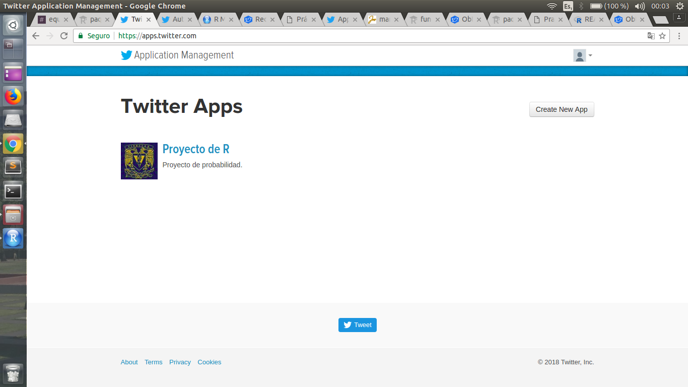

```{r setup, include=TRUE}
knitr::opts_chunk$set(echo = TRUE)
```

### Twitter en R

__0. Funciones de R [rtweet](https://www.rdocumentation.org/packages/rtweet/versions/0.6.0)__

  Una API (_Application Programming Interface_) que es el conjunto de funciones creadas con el fin de ser utilizadas por otro _software_, nos permite implementar tales funciones en nuestro proyecto sin la necesidad de programarlas de nuevo.  
  
  En este caso utilizamos la [__API de Twitter__](https://hipertextual.com/archivo/2014/05/que-es-api/). En éste caso es una __*API REST*__ que es apoyada de __HTTP__(*Hypertext Transfer Protocol*), es decir, nos provee de funciones para poder hacer uso de un servicio web dentro de una aplicación propia, de una manera segura. Al usar ésta __API REST__ nuestro proyecto se limita por las funciones dadas, así, la compañia __Twitter__ se asegura de lo que podamos hacer.  
  
  Para poder usar ésta API necesitamos una cuenta de Twitter

__FUNCIONES__

 1. __Buscar tweets__  
 Nos sirve para buscar los tweets y lo que nos regresa es una lista con los tweets encontrados con la refernecia dada. Los parámetros que ésta función recibe son:
     + *referencia* Los tweets que buscaremos.
     + *n*  el número de tweets que queremos que se busquen.
     + *retweets*  si queremos que incluya los retweets.  
     También puedes agregar unos parámetros llamados:  
     + *retryonratelimit* los límites de la tasa de Twitter.
     + *geocode* se buscan los tweets por área ___*ejemplo: lookup_coords("usa"), "lang:en"*___.  
  
 2. __Tweets de transmisión__  
 Muestra aleatoria (aproximadamente 1%) de la transmisión en vivo de los tweets. Los parámetros que ésta función recibe son:  
     + *""* transmite aleatoriamente los tweets.
     + *geocode* transmite los tweets por área.
     + *timeout* el tiempo de duración de los tweets.  
     + *file_name* el nombre con el que se guardará los tweets.
     + *parse* se analiza gramaticalmente los tweets.  
  
 3. __Conseguir amigos__  
 Busca los amigos de un usuario, y nos regresa una lista de todas las cuentas que sigue un usuario. Los parámetros que ésta función recibe son:  
     + *usuario* el nombre del usuario.
   
 4. __Consigue seguidores__  
 Busca los seguidores de un usuario, y nos regresa una lista de las cuentas que siguen a un usuario. Los parámetros que ésta función recibe son:  
     + *usuario* el nombre del usuario.
     + *n* el tamaño de la lista, es decir, el número de cuentas que siguen a un usuario.
     + *retryonratelimit* los límites de la tasa de twitter.
   
 5. __Obtenga líneas de tiempo__  
 Obtener los tweets más recientes, y regresa una lista con tales tweets. Los parámetros que ésta función recibe son:  
     + *referencia* la referencia a buscar para conseguir los tweets más recientes.
     + *n* el número de tweets que se buscarán.
   
 6. __Obtener favoritos__  
 Obtiene los estados favoritos más recientes. Regresa los tweets favoritos. Los parámetros que ésta función recibe son:  
     + *referencia* la referencia a buscar los tweets favoritos.
     + *n* el número de tweets que se buscarán.
  
 7. __Buscar usuarios__  
 Busca los usuarios con el hashtag en su biografía del perfil, y nos regresa una lista con los usuarios. Los parámetros que ésta función recibe son:  
     + *hashtag* el hashtag a buscar en la biografía de perfil de los usuarios.
     + *n* el número de tweets que se buscarán.
   
 8. __Obtener tendencias__  
 Busca lo que esá en tendencia y lo que regresa lo que está en tendencia en algún estado. Los parámetros que ésta función recibe son:
     + *estado* el nombre del estado a buscar lo que está en tendencia.

__1. Instale y cargue la librería rtweet.__

Para instalar la librería, nos dirigimos a la terminal e introducimos el siguiente código.
```{r instalación, include=TRUE, eval=FALSE}
install.packages("rtweet")
```
Para cargar la librería es el siguiente código
```{r librería, include=TRUE}
library(rtweet)
```

__2. Creamos una `Twitter App`.__


  
__3. `Twitter` token.__

De nuestra `App Twitter` obtendremos los datos para poder crear nuestro token.
```{r creación_del_token, include=TRUE, eval=FALSE}
#Declaramos las variables para poder crear nuestro token y poder hacer la conexión.
name <- "PruebaProba"
key <- "8kM2h7IGrVTm52GIm1Wq1qcm3"
secret <- "h2YBq6UxGHu5n95jcmREKx80bDA7MwhOuTJO6SWwpoq9ZuGR6G"
access <- "1000781805862109184-5GgCkk31NpTaOl53kwcZ5WIZ9L69Cg"
access_secret <- "fuVK52q85uq3pTU9otlvMqyo0qyBfHBmSLXKfZ69kH6cg"
setup_twitter_oauth(consumer_key = key, consumer_secret = secret, access_token = access, access_secret = access_secret)

#Creamos nuestro Token para poder tener acceso a Twitter
#token <- create_token(app = name, consumer_key = key, consumer_secret = secret)
```

__4. Busqueda de tweets.__  

Ya que tenemos el acceso a `Twitter` buscamos los tweets que contienen el `#UNAM` e imprimos los primeros 10.
```{r busqueda, include=TRUE}
unam <- searchTwitter("#UNAM", n = 2000)
head(unam,10)
```

__5. Buscando usuarios.__  

Con los datos obtenidos en el paso 4 contestamos ¿quién es el usuario cuyos tweets han recibido la cantidad total de “favoritos”?
```{r usuarios_busqueda, include=TRUE}
#Vector para guardar los nombres de los tweets buscados.
users <- c(unam)
#Vector de listas con las listas de los estados favoritos de cada usuario.
fav <- favorites("kevxitha", n = 10)
#len <- sapply(fav, length)
#m <- max(len)
fav
#ASignamos el nombre del usuario que ha recibido mas favoritos y así usarla.
#nameUser <- unam$screen_name[m]
```

__6. Ubicación geográfica.__  

Con los tweets obtenidos calculamos la ubucación geográfica mas recurrente.
```{r librería_maps, include=TRUE}
#Cargamos la librería maps
library(maps)
##Creamos lat_lon para obtener la ubcicación de los tweets
rt <- lat_lng(unam)

## plot state boundaries
maps::map("world","mexico", lwd = .50)

## plot lat and lng points onto state map
with(rt, points(lng, lat, pch = 10, cex = .75, col = rgb(0, .3, .7, .75)))
```

__7. Tweets disponibles.__  

```{r timeline, include=TRUE}
timeline <- get_timeline(nameUser)
timeline
```

__8. Gráfico.__  

Graficamos la distribución de los tweets por hora del día y fuente.
```{r gráfico, include=TRUE}
## get user IDs of accounts followed by CNN
tmls <- get_timelines(c("cnn", "BBCWorld", "foxnews"), n = 3200)

## plot the frequency of tweets for each user over time
tmls %>%
  dplyr::filter(created_at > "2017-10-29") %>%
  dplyr::group_by(screen_name) %>%
  ts_plot("days", trim = 1L) +
  ggplot2::geom_point() +
  ggplot2::theme_minimal() +
  ggplot2::theme(
    legend.title = ggplot2::element_blank(),
    legend.position = "bottom",
    plot.title = ggplot2::element_text(face = "bold")) +
  ggplot2::labs(
    x = NULL, y = NULL,
    title = "Frequency of Twitter statuses posted by news organization",
    subtitle = "Twitter status (tweet) counts aggregated by day from October/November 2017",
    caption = "\nSource: Data collected from Twitter's REST API via rtweet"
  )
```

__9. Obtener amigos.__  

Obtenemos las cuentas de los amigos del usuario del paso 5.
```{r obtener, include=TRUE}
friend <- get_friends(nameUser)
friend
```

__10. Porcentaje.__  

¿qué porcentaje de sus seguidores también son seguidos por el usuario?
```{r porcentaje, include=TRUE}
da <- users_data(unam)
da
```

__11. Tendencias.__  

Buscamos primero cuales son las tendencias disponibles.
```{r tendencia, include=TRUE}
available <- trends_available()
available$name
```

Buscamos la tendencias en un país.
```{r ciudadpais, include=TRUE}
trends <- get_trends(available$name[7])
trends$trend
```
